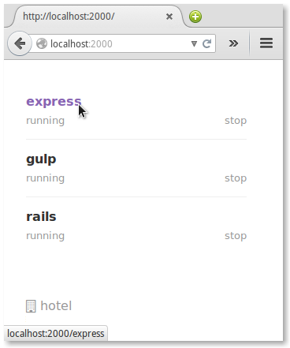

# hotel [](https://travis-ci.org/typicode/hotel) [](https://www.npmjs.com/package/hotel) [](https://github.com/feross/standard)

Easily start, stop and access your servers from the browser

```
   _____
   |___|
 __|^_^|__  
 |  .    |
 |  .    |
_|_______|_ Welcome! Please enjoy your stay.
```

__Install__

```bash
npm install -g hotel
```

__Add your servers__ (need to be done only once)

```bash
~/node-app$ hotel add nodemon
~/html-app$ hotel add 'serve -p $PORT'
```

if you're using [nvm](https://github.com/creationix/nvm) or similar, add `-e PATH` (i.e. `hotel add nodemon -e PATH`).

__Start hotel__

```bash
~$ hotel start
~$ hotel autostart # Create an autostart script (recommended)
```

__Relax__

Your servers can now be accessed, started and stopped from [localhost:2000]().

No need to open a terminal (works on OS X, Linux and Windows).



## Usage

To add a server

```bash
hotel add <cmd> cmd [opts]

# Examples:
hotel add nodemon -o out.log # Set output file
hotel add nodemon -n name    # Set custom name
hotel add nodemon -e PATH    # Save current environment variable
                             # (use it with version managers)
```

To list, start and stop servers go to

```
http://localhost:2000
```

To start and access directly your server go to

```
http://localhost:2000/<app-name>
```

Other commands

```
hotel ls           # List servers
hotel rm [name]    # Remove server
hotel start        # Start daemon
hotel stop         # Stop daemon
hotel autostart    # Add autostart script
hotel rm-autostart # Remove autostart script
```

## Port variable

For `hotel` to work, your servers need to listen on the PORT environment variable.
Here are some examples showing how you can do it from your code or the command-line:

```javascript
var port = process.env.PORT || 3000
server.listen(port)
```

```bash
# OS X, Linux
hotel add 'cmd -p $PORT'

# Windows
hotel add "cmd -p %PORT"
```

## Hotel files

`~/.hotel` contains daemon log, servers and daemon configurations.

```bash
~/.hotel/conf.json
~/.hotel/daemon.log
~/.hotel/servers/<app-name>.json
```

## License

MIT - [Typicode](https://github.com/typicode)
